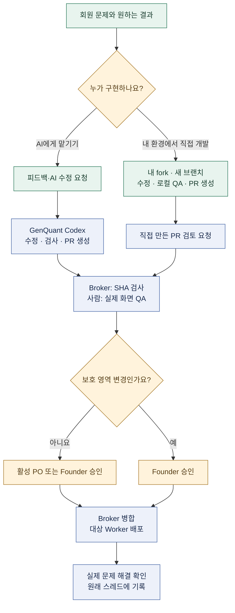

# PO 개발실 안내와 작업 흐름

PO는 Product Owner, 즉 회원의 문제를 찾아 개선을 끝까지 맡는 참여자입니다. 코딩은 필수가 아닙니다. 개발 과정과 질문은 `po-dev`, 담당자·승인·배포 기록은 `po-work`의 원래 작업 스레드에 남깁니다.

## 작업 흐름



원하는 결과가 미정이면 의견만 접수하고 AI 실행을 시작하지 않습니다. Draft PR은 검토 전용입니다. 검사 실패 또는 새 커밋이 생긴 경우에는 다시 검증한 최신 SHA로 승인받습니다. 병합, 배포, 실제 사용 확인은 각각 별도 단계입니다.

## 두 가지 경로

- 일반 경로: Slack의 **피드백·AI 수정 요청**에 문제와 원하는 결과를 씁니다. GenQuant의 Codex가 PR까지 만들므로 PR 주소를 직접 연결하지 않습니다. 결과를 검토한 뒤 승인합니다.
- 직접 개발: 본인 개발환경이나 본인 AI에서 코드를 고쳤다면 GitHub PR을 만든 뒤 **직접 만든 PR 검토 요청**을 사용합니다. 같은 작업에 두 경로를 동시에 실행하지 않습니다.

## 직접 개발 시작

```sh
git clone https://github.com/YOUR_GITHUB_ID/ot1l.git
cd ot1l
git remote add upstream https://github.com/Betalgeuse/ot1l.git
git switch -c feature/short-description
bun install --frozen-lockfile
bun run check
git push -u origin feature/short-description
```

먼저 본인 계정으로 저장소를 fork하고 `AGENTS.md`, `CONTRIBUTING.md`를 읽습니다. PR의 대상은 `Betalgeuse/ot1l:main`입니다. 명령 검사 외에 일반 회원·PO·모바일 UI, 빈 입력, 반복 클릭, 오래된 버튼, API 실패를 확인합니다. DB 변경에는 임시 PostgreSQL 검사도 필요합니다.

## 수정 영역과 승인

실제 정책은 [change-policy.mjs](../automation/runner/change-policy.mjs)와 [기여 안내](../CONTRIBUTING.md)가 결정합니다. 이벤트 UI, 공개 홈·공용 디자인, 문서·QA, 제한된 Slack 표시 데이터는 PO 승인 대상입니다. 운영 DB·회원 권한·비밀·배포기 등 보호 능력을 쓰는 일반 백엔드는 Founder 검토를 유지합니다. 공용 CSS는 홈페이지와 이벤트 양쪽에서 확인합니다.

운영 키나 SSH 접속은 필요 없습니다. `.dev.vars`·운영 설정·개인정보를 소스나 AI 프롬프트에 넣지 않습니다. 로컬에서 운영 배포하지 않고 승인 후 Broker에 맡깁니다.

## Canvas 갱신 운영

사용자에게 보이는 안내 원본은 `src/community-maintainer-canvases.ts`입니다. Mermaid 원본은 이 문서의 코드 블록이며 GitHub에서 도표로 볼 수 있습니다. Slack에는 Mermaid를 렌더링한 PNG를 넣습니다.

```sh
mmdc -i docs/PO_DEVELOPMENT.md -o /tmp/otl1-po-development.png -w 1400 -s 2
```

Markdown 입력이므로 실제 이미지 이름에는 Mermaid CLI가 `-1` 접미사를 붙일 수 있습니다. 생성물을 시각 검사하고 Slack에 업로드한 뒤, 반환된 이미지 permalink를 로컬 `PO_DEVELOPMENT_DIAGRAM_URL`로 지정합니다. 운영 토큰과 실제 permalink는 문서에 커밋하지 않습니다. `bun scripts/publish-maintainer-canvases.mjs`로 대상을 미리 보고 `--apply`로 발행합니다. 이미지 URL이 없으면 발행을 중단해 기존 그림을 지우지 않습니다.

발행 전 기존 Canvas를 백업하고 사람의 추가 내용을 확인합니다. 같은 Canvas ID와 채널 탭을 유지하며, 본문 교체와 제목 변경을 별도로 수행합니다. `files.info` 제목, 내보낸 본문, 채널의 Canvas 탭, 실제 렌더링을 모두 확인합니다.
