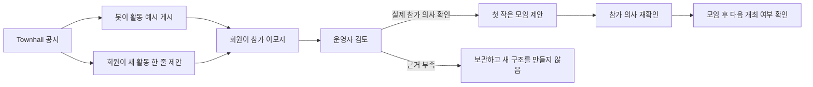

# OT1L 프라이빗 하우스 운영 설계

> 상태: 2026년 9월 30일 Townhall 공지를 게시했고, 10월 31일까지 첫 활동 의견을 받고 있습니다. 별도 입력 기능과 자동 모임 생성은 구현하지 않았습니다.

이 문서는 OT1L 회원이 부담 없는 활동을 함께하며 자연스럽게 친해지고, 필요할 때 서로의 일과 경험도 나눌 수 있게 만드는 운영 방식을 한곳에서 관리합니다. 현재 제품 원칙은 [제품 원칙](../PRODUCT_PRINCIPLES.md), 구현 순서는 [로드맵](../ROADMAP.md), 판단이 바뀐 과정은 [설계 일지](./DESIGN_JOURNAL.md)를 따릅니다.

## 지금 다루는 문제

### 관찰된 사실

- 회원 수가 초기보다 늘었다.
- 한 회원이 “나와 같은 주제의 사람이 보이지 않아 커뮤니티의 매력이 약하다”는 취지의 피드백을 남겼다.
- 현재 OT1L에는 ONE THING과 후기를 공유하는 공통 리듬이 있지만, 누가 어떤 문제를 풀고 있고 누구와 대화할 수 있는지는 쉽게 보이지 않는다.

한 사람의 피드백은 중요한 문제 발견 신호지만 전체 회원의 공통 요구를 입증하지 않는다. “인원이 늘면서 이런 요구가 생길 것을 예상했다”는 운영자의 판단과 “실제로 다수가 같은 요구를 가지고 있다”는 사실도 구분한다.

### 사용자와 운영자가 원하는 방향

- 회원 수가 어느 정도 모인 지금을 자연스러운 다음 단계로 설명한다.
- 문제가 터져 급히 대응하는 인상을 주지 않는다.
- 봇이 활동 예시를 먼저 제안해 회원이 이모지만 눌러도 참여할 수 있게 한다.
- 목록에 없는 활동은 회원이 같은 스레드에 한 줄로 추가할 수 있게 한다.
- 별도 기능을 먼저 만들지 않고 Slack 스레드에서 가장 작은 방식으로 의견을 받는다.

### 검증할 가설

1. 회원에게 먼저 필요한 것은 같은 직무의 사람을 분류하는 기능보다, 피클볼·포커·보드게임처럼 부담 없는 활동을 함께하며 익숙해질 계기일 수 있다.
2. 자유로운 공개 설문보다 다른 사람의 활동 제안을 읽고 이모지 하나로 참여 의사를 보이는 방식이 부담을 낮출 수 있다.
3. 봇이 먼저 제안한 활동에 실제 참가 의사가 모이면 영구적인 Silo보다 한 번의 작은 모임이 관계 형성에 더 적합할 수 있다.

이 세 문장은 아직 검증된 사실이나 구현 요구사항이 아니다.

## 벤치마크에서 가져올 운영 원리

상세 출처와 한계는 [2026-09-29 설계 일지](./DESIGN_JOURNAL.md#2026-09-29--프라이빗-하우스-운영-모델-조사)에 기록했다.

| 사례 | 핵심 운영 장치 | OT1L에서 가져올 부분 |
| --- | --- | --- |
| [Soho House](https://www.sohohouse.com/about) | 하나의 House 정체성, 반복되는 회원 프로그램, 운영팀의 소개, 회원 주도 행사 | 회원 명단만 제공하지 않고 반복해서 마주칠 이유를 만든다. |
| [Chief](https://chief.com/community) | 현재 목표·경력 단계에 따른 Core Group과 Community Manager의 소개 | 직함보다 지금 풀고 있는 문제를 연결 기준으로 쓴다. |
| [Hampton](https://joinhampton.com/faq) | 약 9~10명의 월간 Core, 훈련된 진행자, Commitment·Candor·Confidentiality | 작은 대화, 진행자, 비밀보장 규칙을 함께 둔다. |
| [YPO](https://www.ypo.org/the-ypo-experience/)·[EO](https://eonetwork.org/membership/forum) | 전체 네트워크, 관심 Network, 6~10명 Forum을 다른 층으로 운영 | 전체 소속감과 깊은 대화를 하나의 그룹으로 해결하지 않는다. |
| [South Park Commons](https://www.southparkcommons.com/faq) | 공통 전환기와 행동 강도, 실제 공간, 책임 모임과 학습 포럼 | 직무가 달라도 같은 실행 단계와 태도가 공통점이 될 수 있다. |

현재 유지할 구조는 `하나의 House → 같이 해보고 싶은 활동 제안 → 가벼운 참여 신호 → 한 번의 작은 모임`이다. 영구적인 직무 채널, 고정 Silo, 자동 Buddy는 첫 단계로 채택하지 않는다.

공식 서비스 페이지는 각 조직이 제공한다고 설명하는 운영 장치를 보여줄 뿐, 그 장치의 독립적인 효과를 증명하지 않는다. 유사성이 관계 형성을 돕는 동시에 접하는 정보와 관점을 좁힐 수 있다는 [동질성 연구](https://doi.org/10.1146/annurev.soc.27.1.415), 심리적 안전감과 팀 학습 행동의 연관성을 살핀 [Edmondson의 연구](https://dash.harvard.edu/entities/publication/13a7b031-0fdd-45ec-a7e0-2b80e2bc679f)를 설계 경계로 참고한다. 두 연구 모두 현재 OT1L 운영안의 효과를 직접 검증한 자료는 아니다.

## 사교와 이벤트의 층

| 층 | 사람이 하는 행동 | 운영자가 하는 일 | OT1L 후보 |
| --- | --- | --- | --- |
| 일상적 존재감 | 다른 사람의 ONE THING과 후기를 보고 이모지로 반응 | 반응이 특정 사람에게만 몰리지 않는지 살핀다. | 현재 Slack 흐름 유지 |
| 활동 발견 | 봇의 활동 예시나 회원 제안을 읽고 참가 의사를 표시 | 예시를 먼저 게시하고 반응의 의미를 고정한다. | Townhall House 의견 스레드 |
| 작은 사교 모임 | 피클볼·포커·보드게임·러닝·식사 같은 활동을 함께한다. | 참가 의사를 다시 확인하고 장소·비용·안전을 준비한다. | 4~8명 첫 모임 |
| 반복 모임 | 반응이 좋았던 활동을 다시 연다. | 새 사람도 들어올 수 있게 진행자와 정원을 관리한다. | 실제 재참여 수요가 확인된 뒤 검토 |
| 전체 House | 공동 방향과 배움을 나눈다. | 중요한 변화, 실제 사례, 다음 실험을 설명한다. | Townhall |

각 층은 서로 다른 행동이다. 이모지 반응을 실제 참가로 계산하지 않고, 사교 모임 참가를 ONE THING 수행으로 계산하지 않는다. 모든 모임에 업무 대화나 다음 행동을 억지로 붙이지 않는다.

## Townhall House 의견 수렴 제안

### 제안하는 화면 구조

Townhall에 **공지 한 개만** top-level로 게시한다. 봇이 공지 스레드에 피클볼·포커·보드게임·러닝·전시·저녁 식사를 각각 별도 답글로 먼저 제안한다. 회원은 원하는 활동에 이모지를 누르고, 목록에 없는 활동만 같은 스레드에 한 줄로 추가한다.

이 구조를 추천하는 이유는 다음과 같다.

- Townhall의 중요한 공지 성격을 유지한다.
- 의견마다 새 채널 글을 만들지 않아 피드를 점유하지 않는다.
- 어떤 의견에 반응했는지 맥락이 분명하다.
- 공지와 의견을 하나의 기간 단위로 닫고 보관할 수 있다.

스레드 답글이 잘 발견되지 않을 수 있으므로 공지 본문에 “아래 스레드에서 다른 의견도 보고 이모지로 알려주세요”라고 명확히 쓴다. 운영 기간 중 새 top-level 알림을 반복해서 보내지 않는다. 필요하면 종료 직전에 한 번만 기존 공지를 다시 안내한다.

### 게시 순서

1. OT1L 봇 프로필로 `townhall`에 top-level 공지 한 건을 게시한다.
2. 중요한 방향 논의임을 알리기 위해 첫 게시에만 `@channel`을 사용한다. 같은 수렴 기간에는 다시 전체 멘션하지 않는다.
3. 본문은 `OT1L의 정체성 → 왜 지금 이야기하는지 → 활동 예시 → 의견이 어떻게 쓰이는지` 순서로 쓴다.
4. 새 버튼은 두지 않는다. 제품 버그용 `피드백 남기기`, 친구 초대, 자기소개 버튼도 이 공지에 붙이지 않는다.
5. 봇이 활동 예시를 한 답글에 하나씩 게시하고 `🙋` 반응만 미리 열어둔다. 별도의 반응 방법 안내 답글은 올리지 않는다.
6. 회원의 새 제안은 작성자가 직접 같은 스레드에 한 줄로 남긴다.
7. 2026년 10월 31일까지 받고, 종료 전에 필요할 때만 같은 스레드에 한 번 알린다.
8. 종료 뒤 운영자가 바로 기능이나 모임을 약속하지 않고, 확인된 공통점·차이·다음 작은 실험을 새 Townhall 글로 공유한다.

첫 게시에는 중요한 방향 논의임을 알리기 위해 `@channel`을 한 번 사용했다. 같은 수렴 기간에는 다시 전체 멘션하지 않는다.

### 게시한 공지 문안

2026년 9월 30일 OT1L 봇이 Townhall에 게시한 문안이다.

> <!channel>
>
> *OT1L에서 같이 뭐 하고 놀까요?*
>
> OT1L은 오늘 가장 중요한 업무 하나를 한 문장으로 정하고, 실행하고, 돌아보는 프라이빗 커뮤니티입니다. 서로의 ONE THING을 계속 보다 보니, 이제는 목표와 후기 밖에서도 조금 더 편하게 친해질 자리를 만들어보려고 합니다.
>
> 처음부터 함께하는 분들이 어느 정도 모이면 이런 시간이 필요해질 거라고 생각했습니다. 지금이 딱 무엇을 같이 하면 좋을지 여러분의 의견을 받을 때인 것 같아요.
>
> 피클볼, 포커, 보드게임, 러닝, 전시, 맛있는 저녁처럼 같이 해보고 싶은 활동이 있다면 편하게 반응이나 의견을 남겨주세요.
>
> 의견은 10월 31일까지 천천히 받을게요.
>
> 남겨주신 의견과 반응을 살펴본 뒤, 실제 참가 의사와 준비 여건이 맞는 활동부터 구체적인 일정으로 다시 제안드릴게요.

### 첫 회 입력 방식

첫 회에는 익명 의견 버튼을 만들지 않는다.

- 피클볼·포커·보드게임·러닝·전시·저녁 식사는 봇이 먼저 답글로 게시한다.
- 회원은 `🙋`만 눌러도 참여 의사를 표현할 수 있다.
- 목록에 없는 활동은 같은 스레드에 `클라이밍도 해보고 싶어요`처럼 한 줄로 남긴다.
- 일정·장소·공개 범위와 진행자는 실제 모임 후보가 생긴 뒤 다시 확인한다.

가벼운 사교 활동은 민감도가 낮고, 제안자가 보이면 실제 준비를 함께하기 쉽다. 반면 익명 기능은 작성자 연결의 별도 저장, 수정·삭제, 악용 대응과 정확한 고지가 필요하다. 작은 커뮤니티에서는 문체와 내용으로 작성자를 추정할 수도 있다. 먼저 공개 제안 방식의 실제 부담을 관찰하고, 공개하기 어렵다는 회원 신호가 확인될 때 익명 기능을 다시 검토한다.

### 이모지의 고정된 의미

구조화된 신호에는 랜덤 커스텀 이모지를 쓰지 않는다.

- `🙋`: 나도 같이 하고 싶어요.

나머지 이모지는 분위기 표현으로 남겨두고 수요 판단에 합산하지 않는다. 반응 수는 인기 점수나 회원 점수로 만들지 않는다. 공개 반응은 다른 사람의 판단을 따라가게 만드는 효과가 있을 수 있으므로, 운영자는 높은 숫자만 보지 않고 서로 다른 회원의 관심과 기여 의사가 함께 있는지 확인한다.

공개된 첫 긍정 평가가 후속 평가와 최종 점수를 높인 현장실험과, 다른 사람의 선택 수가 보일 때 성공의 불평등과 예측 불가능성이 커진 실험이 있다. [Muchnik·Aral·Taylor](https://snap.stanford.edu/class/cs224w-readings/muchnik13bias.pdf)·[Salganik·Dodds·Watts](https://www.princeton.edu/~mjs3/salganik_dodds_watts06_full.pdf) OT1L 의견 카드와 동일한 환경은 아니지만, 반응 수를 자동 의사결정이나 인기순 노출에 쓰지 않을 이유가 된다.

### 의견의 흐름

제안을 남겼다고 바로 모임이 열리지 않는다. 이모지가 일정 수를 넘었다고 자동으로 이벤트를 만들지도 않는다. 반응은 후보 발견 신호이고, 실제 개최는 참가 의사와 비용·장소·안전·진행 가능성을 확인한 뒤 결정한다.

### 제품 피드백과 분리

현재 `피드백 남기기`는 불편과 개선 요청을 `As-Is / To-Be`로 정리해 Codex 작업 후보로 보내는 흐름이다. House 의견은 커뮤니티 운영 선택지이며 자동 수정 요청이 아니다.

| 구분 | 제품 피드백 | House 의견 |
| --- | --- | --- |
| 목적 | 버그·기능 개선 | 함께할 사교 활동과 이벤트 수요 발견 |
| 공개 범위 | 제보자와 운영·개선 스레드 | Townhall 공지 스레드에서 공개 |
| 후속 처리 | 관리자 검토, 필요시 코드 변경 후보 | 회원 반응 관찰, 필요시 작은 운영 실험 |
| 완료 의미 | 검증된 제품 변경 또는 답변 | 의견 보관, 작은 모임 제안, 또는 근거 부족으로 종료 |

첫 회 House 의견에는 별도 입력 버튼이나 Codex 자동화를 연결하지 않는다. Townhall 스레드의 메시지와 반응만 운영 근거로 사용한다.

## 첫 회 운영 기록

첫 회에는 새 DB를 만들지 않고 Slack 원문을 기준으로 다음 사실만 확인한다.

| 사실 | 보존 이유 | 공개 범위 |
| --- | --- | --- |
| 의견 수렴 기간과 공지 위치 | 어느 공지에 속한 의견인지 확인 | 회원 공개 |
| 봇의 활동 예시와 회원의 새 제안 | 무엇에 반응했는지 확인 | 회원 공개 |
| Slack 제안 위치 | 반응과 원문 연결 | 회원 공개 |
| 의미가 고정된 회원 반응 | 참가 후보 구분 | Slack에서 공개 |
| 운영자 판단과 이유 | 왜 모임을 열거나 열지 않았는지 기록 | 운영자 제한, 결과만 회원에게 설명 |
| 모임 참가 동의 | 이모지 반응과 실제 참가를 분리 | 해당 참가자와 운영자 |

같은 활동 제안이 여러 번 올라오면 운영자가 하나의 후보로 읽되 원문을 임의로 지우거나 합치지 않는다. Slack 반응이 제거되면 참가 의사에서도 제외한다.

## 첫 운영 실험 후보

2026년 10월 31일까지 의견을 받는다. 첫 실험의 목적은 가장 인기 있는 활동을 뽑는 것이 아니라 **회원들이 부담 없이 같이 시간을 보낼 수 있는 첫 모임 하나를 실제로 여는 것**이다.

1. Townhall 공지 한 건을 게시한다.
2. 봇이 활동 예시를 같은 스레드에 각각 게시하고, 회원은 새 활동을 공개 답글로 제안한다.
3. 회원은 `🙋`로 참가 의사를 표현한다.
4. 서로 다른 회원 3명 이상이 참가 의사를 보이면 운영자가 비용·장소·안전·진행 부담을 검토한다.
5. 운영자가 후보 활동의 참가 의사를 별도로 다시 확인한다.
6. 4~8명이 자발적으로 모일 때 한 번의 작은 활동을 연다.
7. 모임 뒤 다시 하고 싶은지와 다음 활동 제안만 짧게 확인한다. ONE THING 후기를 요구하지 않는다.

`3명`과 `4~8명`은 연구로 검증된 최적값이 아니라 현재 규모에서 운영비를 제한하기 위한 첫 실험값이다. 10월 31일은 운영자가 정한 첫 수렴 종료일이다.

## 판단 기준과 중단 조건

### 확인할 것

- 제안자 외의 회원이 실제 참가 반응을 보였는가?
- 참가 의사를 다시 확인한 뒤 실제 모임이 한 번이라도 열렸는가?
- 모임 뒤 다시 만나고 싶거나 Slack에서 서로 말을 걸기 편해졌다는 응답이 있는가?
- 공개 제안이 어색해서 의견을 포기하거나 운영자에게 따로 전달한 사례가 있는가?
- 인기 편중, 관계 의무, 알림 부담이 생겼는가?

### 성공으로 보지 않을 것

- 의견 카드 수와 이모지 총수
- 봇이 만든 소개·요약 메시지 수
- 유명한 회사·학교·직함을 가진 회원의 참여
- 실제 참가 없이 “재밌겠다”는 반응만 많은 상태

### 중단하거나 바꿀 조건

- 의견은 모이지만 참가 의사를 다시 물었을 때 아무도 오지 않는다.
- 공개 제안 부담 때문에 실제 아이디어가 반복해서 운영자에게만 전달된다.
- 반응 수가 공개 인기 경쟁이나 특정 회원의 영향력 점수가 된다.
- 활동의 비용·안전·장소 부담이 현재 운영 규모를 넘는다.
- 운영자가 반복적인 예약과 진행을 감당할 수 없다.

## 구현 전에 정할 것

1. 첫 의견 수렴을 한 번만 할지, 분기별로 반복할지
2. 모임을 운영자가 직접 준비할지, 회원 진행자를 받을지
3. 모임 참가자를 촬영하거나 후기를 공개할 때 별도 동의를 어떻게 받을지
4. 공개 제안이 어렵다는 실제 신호가 어느 정도 쌓이면 익명 기능을 다시 검토할지

## 현재 제안

- 이번 회원 피드백은 적절한 문제 발견 신호로 기록한다. 전체 회원의 합의로 표현하지 않는다.
- Townhall에는 “인원이 늘며 자연스럽게 예상했던 다음 단계”라는 맥락으로 한 건의 공지만 준비한다.
- 봇이 먼저 게시한 활동 예시, 회원의 공개 한 줄 제안, `🙋 같이 하고 싶어요` 반응을 첫 수렴 방식으로 검토한다.
- 의견 수렴은 제품 버그 피드백·Codex 자동 개선과 분리한다.
- 첫 회에는 새 버튼과 DB를 만들지 않는다. Townhall 공지는 게시했으며 첫 모임 개최는 10월 31일까지의 실제 반응을 본 뒤 결정한다.
